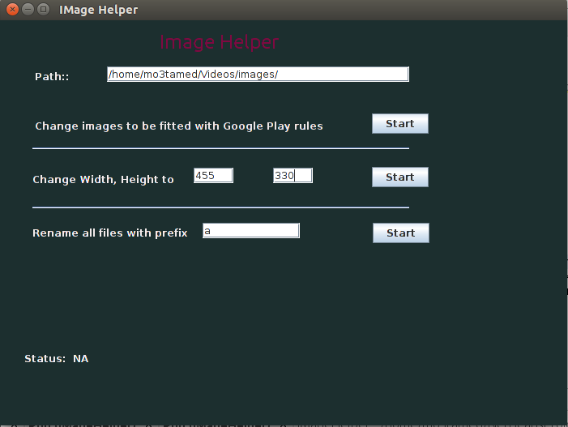

# ImageHelperPro
Tool to facilate modify images to be fitted with google play listing requirements and other operation with images

# Screenshoots 

# Motiviation
I have used my phone to take screenshoot for **store listing** to be used as **graphic asset** to my apps but I have faced problem with app resolution which is not comptabile with  **graphic asset** constraints(min = 320px , max = 3840, aspectRatio= 2:1)  with images so tradional solution is to resize each image (take time which can be saved **^_^** ) so i make this tool to **save time.** 

# Feature
- add images of a folder and it generates new images for android listing.

# Todo
- [x] rename images with specified name.
- [x] resize with specfic size.
- [ ] make feature graphic.
