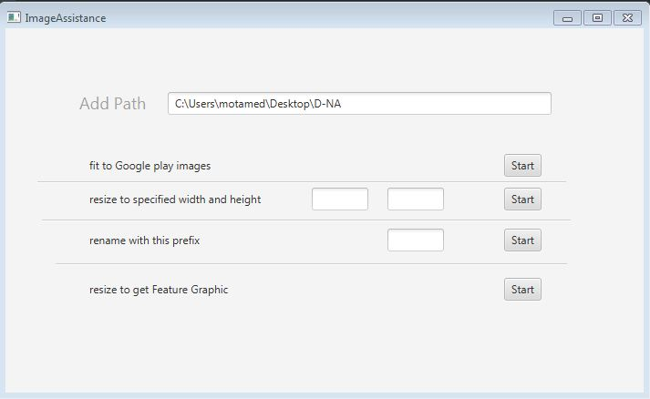

# ImageAssistance

Tool to **automate** modifing images to be fitted with **google play listing** requirements and other operation with images.

# Screenshoots 

# Motiviation
- I have used my phone to take screenshoot for **store listing** to be used as **graphic asset** to my apps but I have faced problem with app resolution which is not comptabile with  **graphic asset** constraints(min = 320px , max = 3840, aspectRatio= 2:1)  with images so tradional solution is to resize each image (take time which can be saved **^_^** ) so i make this tool to **save time.** 

- I was working on android app that deals with about 600 pages named 0 until last but this not valid name (should not start with number) so I had to rename files manually, but with this tool you can rename all files with just one click.   

# Feature
- [X] **resize** images of a folder and it generates new images for android listing.
- [x] **rename** images with specified name.
- [x] **resize** with specfic size.
- [x] **make** feature graphic.
- [ ] add file chooser instead of write path. 
- [ ] provide detailed message with each operation. 

# How to use 
## for windows 
- open **.jar** file.
